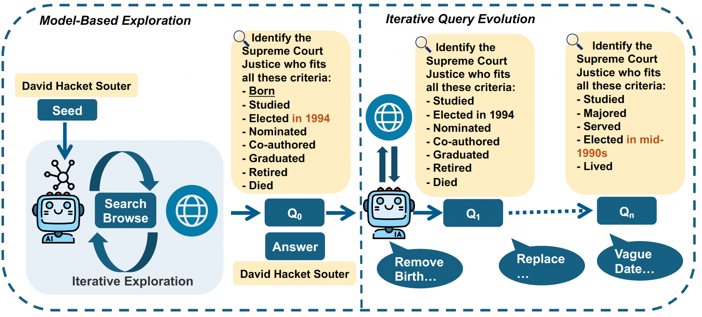
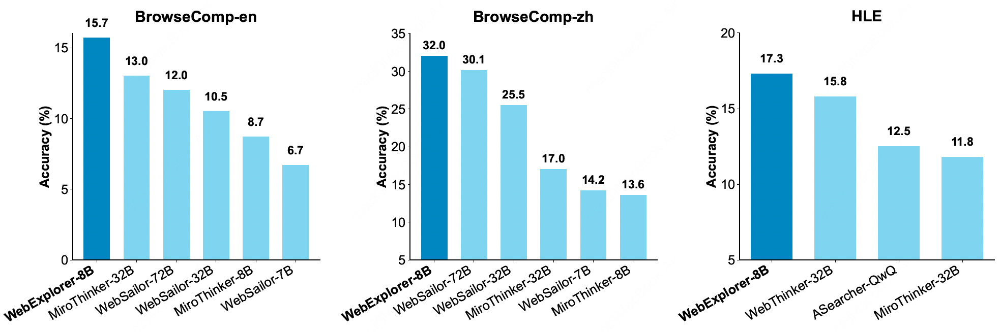

# WebExplorer: Explore and Evolve for Training Long-Horizon Web Agents

<!-- [](https://arxiv.org/abs/2025.xxx) -->
[](https://huggingface.co/hkust-nlp/WebExplorer-8B)
[](https://huggingface.co/datasets/hkust-nlp/WebExplorer-QA)
[](LICENSE)

## Abstract

WebExplorer introduces a systematic approach for training long-horizon web agents through model-based exploration and iterative query evolution. Our method generates challenging query-answer pairs requiring multi-step reasoning and complex web navigation, achieving state-of-the-art performance at 8B parameter scale.

<div align="center">
  
  <p><em>WebExplorer-QA Construction Pipeline</em></p>
</div>


## 🔥 News
- **[2025/01/08]** :fire: We released our model [WebExplorer-8B](https://huggingface.co/hkust-nlp/WebExplorer-8B) and dataset [WebExplorer-QA](https://huggingface.co/datasets/hkust-nlp/WebExplorer-QA) with 100 high-quality query-answer pairs!


## 📊 Key Results

<div align="center">
  
  <p><em>Performance comparison of WebExplorer-8B across different benchmarks</em></p>
</div>

| Model | BC-en | BC-zh | GAIA | WebWalkerQA | FRAMES | Xbench-DS | HLE |
|-------|-------|-------|------|-------------|--------|-----------|-----|
| OpenAI-o3† | 50.9 | 58.1 | 70.5† | 71.7 | 84.0 | 66.7 | 20.2 |
| Claude-4-Sonnet† | 12.2 | 29.1 | 68.3† | 61.7 | 80.7 | 64.6 | 20.3 |
| GLM-4.5 | 26.4 | 37.5 | 66.0† | 65.6† | 78.9† | 70.0† | 21.2† |
| DeepSeek-V3.1 | 30.0 | 49.2 | 63.1† | 61.2† | 83.7 | 71.2 | 29.8 |
| Kimi-K2† | 14.1 | 28.8 | 57.7 | 63.0 | 72.0 | 50.0 | 18.1 |
|-------|-------|-------|------|-------------|--------|-----------|-----|
| WebShaper-72B | - | - | 60.0 | 52.2 | - | - | - |
| WebShaper-32B (QwQ) | - | - | 53.3 | 49.7 | - | - | - |
| WebShaper-32B | - | - | 52.4 | 51.4 | - | - | - |
| WebSailor-72B | 12.0 | 30.1 | 55.4 | - | - | 55.0 | - |
| WebSailor-32B | 10.5 | 25.5 | 53.2 | - | - | 53.3 | - |
| WebSailor-7B | 6.7 | 14.2 | 33.0 | - | - | 34.3 | - |
| ASearcher-Web-QwQ | 5.2 | 15.6 | 52.8 | 34.3 | 70.9 | 42.1 | 12.5 |
| WebThinker-32B | 2.8 | - | 48.5 | 46.5 | - | - | 15.8 |
| MiroThinker-32B-DPO-v0.1 | 13.0 | 17.0 | 57.3 | 49.3 | 71.7 | - | 11.8 |
| MiroThinker-8B-DPO-v0.1 | 8.7 | 13.6 | 46.6 | 45.7 | 64.4 | - | - |
| **WebExplorer-8B (SFT)** | 7.9 | 21.3 | 43.7 | 59.8 | 72.6 | 47.5 | 16.0 |
| **WebExplorer-8B (RL)** | **15.7** | **32.0** | **50.0** | **62.7** | **75.7** | **53.7** | **17.3** |

*Note: † indicates results from official reports or papers.*

## ✨ Key Features

- 🌐 **Long-horizon Reasoning**: Supports up to 128K context length and 100 tool calling turns
- 🛠️ **Tool Utilization**: Masters search and browse functionalities
- 🏆 **State-of-the-art Performance**: Achieves best-in-class results among models under 10B parameters


## 🚀 Resources

### 🤗 Models
| Model Name | Size | Description | Link |
|:-----------|:-----|:------------|:----:|
| **WebExplorer-8B** | 8B | Long-horizon web agent trained on WebExplorer-QA | [🤗 HuggingFace](https://huggingface.co/hkust-nlp/WebExplorer-8B) |

### 📚 Datasets
| Dataset Name | Size | Description | Link |
|:------------:|:-----|:------------|:----:|
| **WebExplorer-QA** | 100 samples | High-quality query-answer pairs for web agent training | [🤗 HuggingFace](https://huggingface.co/datasets/hkust-nlp/WebExplorer-QA) |


## 🛠️ Tool Schema

WebExplorer-8B supports two tools for web interaction:

### 1. Browse Tool

```json
{
    "name": "browse",
    "type": "function",
    "description": "Extract specific information from a webpage",
    "parameters": {
        "type": "object",
        "properties": {
            "url": {
                "type": "string",
                "description": "Target URL to browse. The webpage content will be processed by the LLM for information extraction."
            },
            "query": {
                "type": "string",
                "description": "Specific query about the webpage content. The LLM will analyze the content to answer this query."
            }
        },
        "required": ["url", "query"]
    }
}
```


### 2. Search Tool

```json
{
    "name": "search",
    "type": "function",
    "description": "Perform web search queries",
    "parameters": {
        "type": "object",
        "properties": {
            "queries": {
                "type": "array",
                "items": {
                    "type": "string"
                },
                "description": "List of search queries. Returns search results containing title, URL, and snippet for each query."
            }
        },
        "required": ["queries"]
    }
}
```


<!-- ## 📝 Citation

If you find our work useful, please consider citing:

```bibtex
@article{webexplorer2025,
  title={WebExplorer: Explore and Evolve for Training Long-Horizon Web Agents},
  author={Your Authors},
  journal={arXiv preprint},
  year={2025}
}
``` -->
